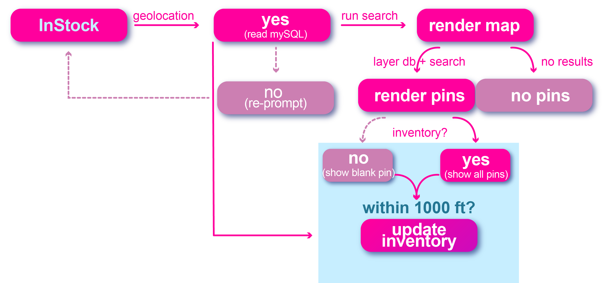

# Toilet Paper Finder
Enables a shopper to quickly and conveniently use a geolocation tool to find stores nearby.  Additional information from either the shop owners (or users within 1000 meters of the facility) can update the inventory from out of toilet paper, some toilet paper, and plenty of toilet paper.

## Deployed at
*   https://findinventory.herokuapp.com/
*   using CLI: ```npm start```

## Architecture
**_Wireframe_**
*   contains passport for 'member' login, which contains the ability for shop owners to update their inventory from a remote location.
*   map page is the main functional page that renders a Azure Maps

**_Structure_**
*   Content delivered from Heroku.
*   Data is stored remotely and overwrites Azure Map Pins utilizing address write/post function

**_UserFlow_**
*   The User is first prompted to provide geolocaiton permission.
*   System is then scanned to pull any locations in mySQL database.
*   Simultaniously, the system utilizes Azure to find nearby stores.
*   If the user is within 1000 meters of the location, they can update the inventory by clicking on the pin; if not, they can simply view the levels of inventory (red= none in stock, yellow = running low, gold= plenty, question-mark (blue)= a store without a known inventory)


## Credits
*   Wireframe structure, navigation, and responsiveness developed using **Bootstrap**, https://GetBootstrap.com, version 4.4.1.
*   illustrations created in Adobe Illustrator, Ricardo Shaffer.
*   Microsoft Azure Maps
*   Heroku hosting
*   JawsDB
*   Built in collaboration with Matt Link (Handled API Routes), Kenneth (handeled API Routes & DB put commands), Kendra Neves (wireframe structure, member login & inventory update feature), Ricardo Shaffer (Map rendering, posting, pin interaction, writing/getting content, geolocation)


## License
Created using **Boostrap**, **Microsoft Azure**, **Heroku**, **JawsDB**, **Adobe Illustrator**, **PassportJS**, **Express**, **Express-Handlebars**. MIT License, 2020.
